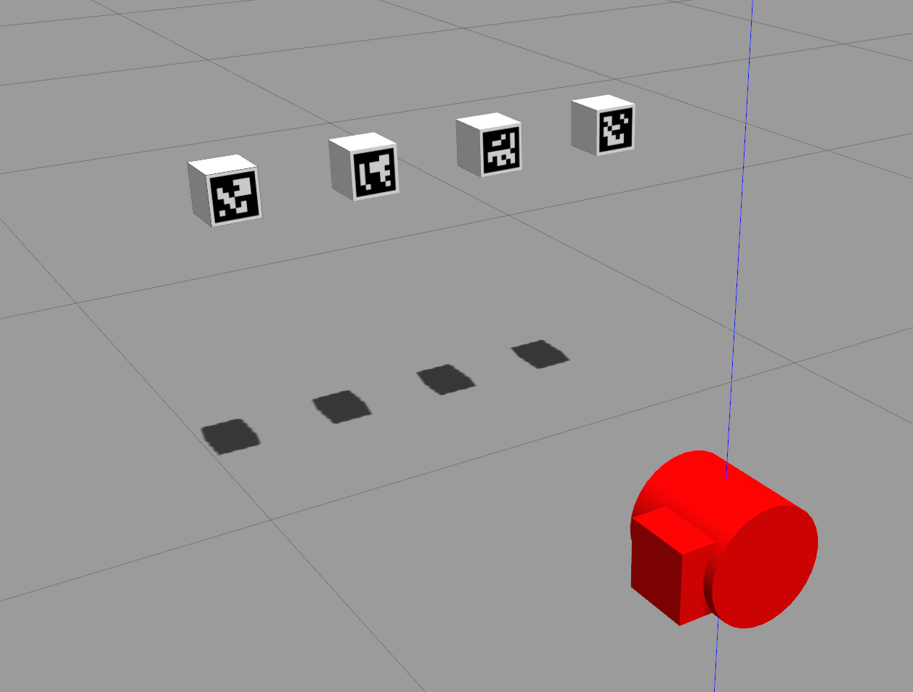

# ArUco simulation test

Packages for accuracy and precision analysis of the ArUco pose estimation using Gazebo simulator




## Dependencies

[rinnaz/ros-toolbox](https://github.com/rinnaz/ros-toolbox)

## How to start

Launch simulation scene

```
roslaunch ast_world basic_world.launch
```
  
Launch marker detector
```
rosrun ast_detector ast_detector
```

Launch controller (rotates markers and saves pose estimation error data)

```
roslaunch ast_controller main_script.launch
```

Draw plots

```
roslaunch ast_controller analyze.launch
```
